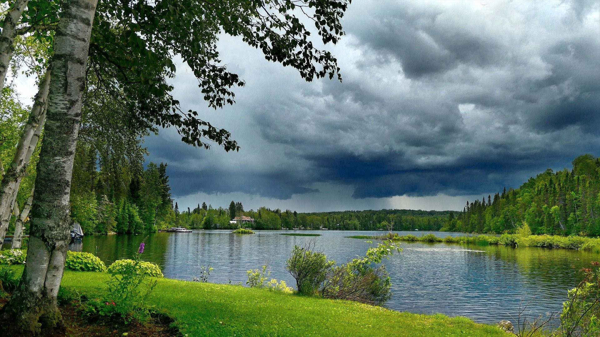

# Image Stenography

A Python script & library for image steganography.

## [Installation](#installation) · [Usage](#usage) · [Manual](#manual) · [Examples](#examples) · [FAQ](#faq) · [License](#license)

The purpose of this project is to provide a way to hide data in images. This project is based on the [Steganography](https://en.wikipedia.org/wiki/Steganography) technique, the practice of concealing a message within an other message. In this case, the message is hidden in an image.  
  
The project is written in Python and uses the [Pillow](https://github.com/python-pillow/Pillow) and [Numpy](https://numpy.org/) library.

## Installation

You can clone the repository using the following command :

```properties
git clone https://github.com/MaelCrd/image-steganography.git
```

## Usage

You can use this project to hide a file whitin an image and retrieve it later.
The current image formats supported are all the ones supported by the [Pillow](https://github.com/python-pillow/Pillow) library except the formats using compression (like JPEG).
I tested the following formats which worked fine :

- PNG
- BMP
- TIFF
- DDS
- DIB
- IM
- PCX
- PPM
- SGI
- TGA

This project can be used either as a library or script. (See the [Manual](#manual) section).

## Manual

### Use as a script

Show help

```properties
python3 image_steganography.py -h
```

Hide a file within an image

```properties
python3 image_steganography.py -e file_to_hide source_image destination_image
```

Recover a file hidden in an image

```properties
python3 image_steganography.py -d source_image
```

Additionnal arguments

- The **-v** or **--verbose** argument will display the progress of the operation.
- The **-b** or **--bits** argument will force the number of bits hidden per color channel.
- The **-dd** or **--decode-destination** argument allow you to specify the destination file where the recovered file will be saved.
- The **-li** or **--large-image** argument will force the Pillow library to handle large images (~ more than 0.2 GB).

For more details on the additionnal arguments see [examples](#examples) below.

### Use as a library

Import the library

```python
import image_steganography
```

<br>

Encode a file within an image

```python
encode_file(to_hide_filename, source_filename, destination_filename, n_bits=None, verbose=False, use_large_image=False)
```

_Parameters_ :

- **to_hide_filename** (String) _required_ - The file to hide
- **source_filename** (String) _required_ - The image to hide the file in
- **destination_filename** (String) _required_ - The image destination
- **n_bits** (Integer) - The number of bits to hide per color channel
- **verbose** (Boolean) - If True, will display the progress of the operation
- **use_large_image** (Boolean) - If True, will force the Pillow library to handle large images (~ more than 0.2 GB)

<br>

Decode a file hidden in an image

```python
decode_image(source_filename, destination_filename=None, verbose=False, use_large_image=False)
```

_Parameters_ :

- **source_filename** (String) _required_ - The image from which to decode the file
- **destination_filename** (String) - The destination file where the decoded file will be saved (without extension)
- **verbose** (Boolean) - If True, will display the progress of the operation
- **use_large_image** (Boolean) - If True, will force the Pillow library to handle large images (~ more than 0.2 GB)

## Examples

After cloning the repository, you should have the following files :

```
📂image_steganography  
 ┣📂.git
 ┣📂examples
 ┣📜.gitignore  
 ┣📜README.md
 ┣📜image_steganography.py
 ┗📜requirements.txt
```

Let's say you want to hide a file called `secret_document.txt` within an image called `nice_image.png`.
You should have the following files :

```
📂image_steganography  
 ┣📂.git
 ┣📂examples
 ┣📜.gitignore  
 ┣📜README.md
 ┣📜image_steganography.py
 ┣📜requirements.txt
 ┣🖼️nice_image.png
 ┗📜secret_document.txt
```

Let's encode the file `secret_document.txt` within the image `nice_image.png` :  
You can use either

- `python3 image_stenography.py -e secret_document.txt nice_image.png nice_image2.png` in a terminal  
Or
- `encode_file("secret_document.txt", "nice_image.png", "nice_image2.png")` in Python

Here is the file `nice_image2.png` :

| Before | After |
:-------------------------:|:-------------------------:
 | 

You can see that no change is visible in the image. This is because the file is very small and the image is quite big (`secret_document.txt` is only 1 KB and `nice_image.png` is about 4 MB).

Let's decode the hidden file within the image `nice_image2.png` :
You can use either

- `python3 image_stenography.py -d nice_image2.png` in a terminal  
Or
- `decode_image("nice_image2.png")` in Python

You now have the file `decoded.txt` in your folder and it contains the content of `secret_document.txt`.
  
<br>

Let's try to encode a file larger : the file `nice_image.png` within itself !  
With an image of size 1920*1080, you can hide a file of size about 6 MB, `nice_image.png` is about 4 MB so it should be fine.

- `python3 image_stenography.py -e nice_image.png nice_image.png nice_image3.png` in a terminal  
Or
- `encode_file("nice_image.png", "nice_image.png", "nice_image3.png")` in Python

Here is the file `nice_image3.png` :

| Before | After |
:-------------------------:|:-------------------------:
 | 

We can now clearly see the changes in the image.

To go further, we'll do te same process but with a number of bits per color channel set to 8 (maximum).

- `python3 image_stenography.py -e nice_image.png nice_image.png nice_image4.png -b 8` in a terminal  
Or
- `encode_file("nice_image.png", "nice_image.png", "nice_image4.png", n_bits=8)` in Python

Here is the file `nice_image4.png` :

| Before | After |
:-------------------------:|:-------------------------:
 | 

We can clearly see the changes in the image. The number of modified pixels is lower than before but the image is now horrible.

<br>

_Notes :_  

- You can encode a file within an image then encode this image within another image etc.. so one image can be used to hide multiple images + 1 file.  
- The file `nice_image3.png` weights 5.3 MB although it contains 2 images weighting each 4 MB. Maybe it can be useful to store multiple images in a single file to reduce the size used on the hard drive.

## FAQ

### How it works ?

1. First :
    - The image is split into a grid of pixels
    - Each pixel as 3 channels (red, green, blue)
    - Each channel is represented by 8 bits (0-255)
2. Then :
    - The file we want to hide is converted into a list of bits
    - The list of bits is then split into chunks of **N** bits (where **N** is the number of bits per color channel we will set aka 'n_bits' in my project)
    - Each chunk is then encoded into a color channel of a pixel  
    For example, if a color channel value is 174 it will be in binary : 10101110  
    Now if we want to encode the chunk **011** into that color channel, its binary value will be : 10101**011**  
    By this process, we lose data and create noise in the image but that noise is not random and can be used to retrieve the hidden file.
3. Finally :
    - The number of bits per color channel ('n_bits') is set on the last pixel of the image (the bottom right corner)
    - The size of the file content we are encoding is stored in the last pixels of the image before the 'n_bits' value
    - Same for the extension of the file we are encoding (.txt, .png, .py, ...) (if the file has an extension)
    - Then the file content is encoded in the pixels starting from the top left corner of the image

The image composition is now the following (not to scale) :

  || File content | (Extension) | Extension bit | File content size | Encoding bit |
  |:--:|:--:|:--:|:--:|:--:|:--:|
  | Pixel count : |#########################|#####|#|########|#|

Thanks for reading !

---

## License

This work is licensed under a
[Creative Commons Attribution 4.0 International License][cc-by].

[![CC BY 4.0][cc-by-image]][cc-by]

[cc-by]: http://creativecommons.org/licenses/by/4.0/
[cc-by-image]: https://i.creativecommons.org/l/by/4.0/88x31.png
[cc-by-shield]: https://img.shields.io/badge/License-CC%20BY%204.0-lightgrey.svg